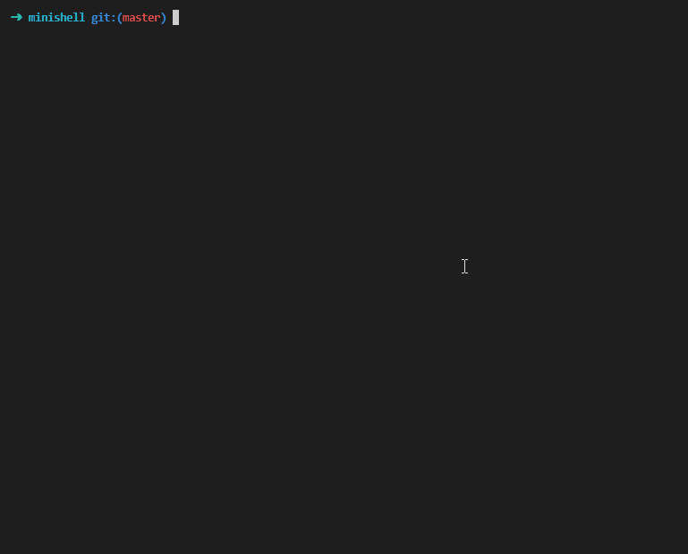

### Welcome to my minishell repository 👋

⭐️ The objective of minishell is to code a simple shell.<br>

<p align="center">
	
</p>

Made with [valentinllpz](https://github.com/valentinllpz/minishell)

## 💡 Usage

```
make
./minishell
```

Features :
- builtins : echo (-n), cd, pwd, export, unset, env, exit ✅
- redirections : > >> < << ✅
- environment variables ✅
- signals : ctrl-C, ctrl-D and ctrl -\ ✅
- pipes ✅
- ";" separator ✅
- in-line editor (<kbd>del</kbd>) ✅
- commands history (<kbd>↑</kbd> <kbd>↓</kbd>) ✅

## Contributors
- [Valentin Lugand](https://github.com/valentinllpz)